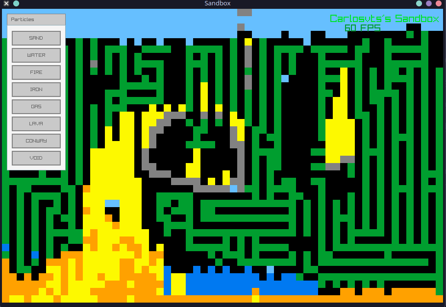

# Sandbox Physics Engine with Raylib C++

A real-time particle simulation engine and physics sandbox developed in C++ & Raylib

This project utilizes the `raylib.h` (pure C) API to manage low-level graphical buffers while implementing custom C++ structures for particle state and grid management.


---

## Gallery

| Project Showcase | Thermal Shock (Lava + Water) | Chaos with Conway |
| :---: | :---: | :---: |
|  |  | 

| Fire & Chain Reactions | Sand & Water Physics |
| :---: | :---: |
|  |  |

---

## About the Project
A high-performance particle simulation engine where emergent behaviors arise from simple local rules. This project explores cellular automata, non-deterministic physics, and real-time rendering of thousands of individual agents interacting in a dynamic grid.

This project implements a "Falling Sand" style simulation where every pixel on the grid is an independent particle with its own properties. By using localized interaction rules, the system simulates complex phenomena like basic fluid dynamics,thermodynamics, and biological patterns.

**Main Objectives:**
* Implement a **Sandbox game** using **Raylib** engine.
* Develop a **Hybrid Neighborhood System**:
    * **Moore Neighborhood (8 neighbors)**: Used for density-based survival and thermal reactions (Fire/Lava).
    * **Von Neumann Neighborhood (4 neighbors)**: Used for directional biological infection and growth patterns.
* Implement non-deterministic behaviors using probability-based state transitions for organic spreading and physical variety.

The architecture separates the physical simulation from the rendering logic, allowing for a clean implementation of element-specific behaviors within a unified grid-processing kernel.

## Technologies

* **Language:** ISO C++17
* **Graphics Library:** [Raylib](https://www.raylib.com/)
* **Compiler:** g++

## How to Build and Run

### Prerequisites

Ensure you have a C++ compiler and the Raylib development headers installed.

For Raylib, check their own repository and go to "**build and installation**"
https://github.com/raysan5/raylib

#### Compiling & Running

For compiling this project using **Raylib**, you need to include the essential headers.

```bash
g++ main.cpp -o sandbox -lraylib -lGL -lm -lpthread -ldl -lrt -lX11

./sandbox
```
## Available Elements & Interactions

### Void
* **Behavior & Interaction**: Just void, you can use it as a erase tool.

### Sand (Granular Solid)
* **Behavior**: Follows gravity with side-slipping logic to form natural piles.
* **Interaction**: Extinguishes Conway cells via physical suffocation (neighbors > 5) when burying them, treating the space occupied by "life" as a vacuum for falling calculations.

### Water 
* **Behavior**: Moves downwards and spreads horizontally to find the lowest available point.
* **Interaction**: Reacts violently with Lava; when mixed with sand, it flows through empty spaces.

### Fire 
* **Behavior**: Spreads non-deterministically through flammable materials using a 3x3 Moore kernel.
* **Interaction**: Quickly consumes Gas and Iron; interacts with Conway cells by burning them as if they were biomass.

### Lava 
* **Behavior**: Heavy and viscous liquid that moves slowly with high density.
* **Interaction**: The "corrosive element". It melts materials and, upon touching water, generates a thermal shock reaction that can turn into gas or Conway seeds

### Conway 
* **Rule Set**: A modified and resilient version of *Game of Life* adapted for a physical environment.
* **Survival**: "Less Restricted" system where particles survive if they have between 0 and 5 neighbors (Moore).
* **Infection**: Expands into empty spaces using only Von Neumann neighborhood (+) with a small mutation chance per frame.

### Gas 
* **Behavior**: Rises vertically with random horizontal diffusion, simulating smoke or steam.
  
---

## Project structure

```Markdown
📁 Project
├── 📄 Makefile         # Automates compilation with Raylib flags
├── 📄 game.cpp         # Core logic: Physics engine and UI implementation
├── 📄 game.hpp         # Global constants, element properties, and function prototypes
├── 📄 main.cpp         # Entry point: Window initialization and main game loop
├── 📄 utils.hpp        # Data structures: Particle struct and element Enums
├── 📄 .gitignore       # Prevents tracking of binaries and object files
└── 📁 assets/          # Project demonstrations and GIFs
    ├── 🎞️ firewithgasandiron.gif
    ├── 🎞️ sandbox_title.gif
    ├── 🎞️ waterdroppingwithlava.gif
    └── 🎞️ waterwithsand.gif
```

##  Resources
Here are the key resources used for developing the physical engine, rendering logic, inspiration and neighborhood rules:

* **Raylib Cheatsheet**: [Quick reference for functions and structures](https://www.raylib.com/cheatsheet/cheatsheet.html)
* **Raylib Official Repository**: [GitHub - raysan5/raylib](https://github.com/raysan5/raylib)
* **Daniel Hirsch - Coding Graphics in Raylib (C)**: [Youtube video](https://www.youtube.com/watch?v=dIpqIlwLYcI)
* **Moore Neighborhood**: [Wikipedia](https://en.wikipedia.org/wiki/Moore_neighborhood)
* **Von Neumann Neighborhood**: [Wikipedia](https://en.wikipedia.org/wiki/Von_Neumann_neighborhood)

--- 
## Reminder
This project was developed for educational purposes to explore the Raylib library and the fundamentals of creating a sandbox game. While the architecture and performance could be significantly further optimized and modularized (e.g, creating a function for the kernel convolutions), my primary goal was to learn basic Raylib stuff.