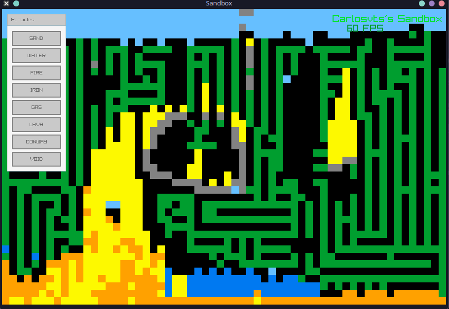

# Sandbox Physics Engine with Raylib C++

A real-time particle simulation engine and physics sandbox developed in C++ & Raylib

This project utilizes the `raylib.h` (pure C) API to manage low-level graphical buffers while implementing custom C++ structures for particle state and grid management.


---

## Gallery

<div align="center">
  
</div>

<br>

| Project Showcase | Thermal Shock (Lava + Water) |
| :---: | :---: |
|  |  |

| Fire & Chain Reactions | Sand & Water Physics |
| :---: | :---: |
|  |  |

---

## About the Project

A high-performance particle simulation engine where emergent behaviors arise from simple local rules. This project explores cellular automata, non-deterministic physics, and real-time rendering of thousands of individual agents interacting in a dynamic grid.

This project implements a "Falling Sand" style simulation where every pixel on the grid is an independent particle with its own properties. By using localized interaction rules, the system simulates complex phenomena like fluid dynamics, thermodynamics, and emergent pattern formation.

The repository contains two executables built on top of the same engine core:

- Sandbox Game: interactive particle simulation environment
- Bad Apple Renderer: real-time rendering of a bitmap-based animation using the same grid and rendering pipeline

The Bad Apple renderer is fully implemented on top of a custom C++ engine. All image decoding, bitmap parsing, and frame processing are handled by a custom-built image processing library (no external multimedia libraries are used). The only external dependency is Raylib, which is used strictly as a low-level graphics backend for window creation and pixel buffer presentation.

Frames are pre-generated as BMP images (with python) and loaded directly by the engine. Each frame is processed through the custom bitmap pipeline and interpreted as a pixel field that is mapped into the simulation grid. From there, the same particle update and rendering system used in the sandbox is reused to display the animation in real time. This design keeps the entire system unified under a single simulation and rendering architecture, where both the sandbox and Bad Apple share the same low-level execution model.

> If you clone this repository, you dont need to use `pip` or `uv` to install the requirements since every image from badapple is already on `frames_bmp/` folder.

---

## Technologies

* Language: ISO C++17
* Graphics Library: https://www.raylib.com/
* Compiler: g++

---

## How to Build and Run

### Prerequisites

Ensure you have a C++ compiler and the Raylib development headers installed.

For Raylib installation:
https://github.com/raysan5/raylib

### Compiling & Running

To run the sandbox game

```bash
make sandbox
./sandbox
```

To run the badapple simulation
```bash
make badapple
./badapple
```

## Available Elements & Interactions

### Void
* Behavior & Interaction: Empty space used as a base state and erase tool.

### Sand (Granular Solid)
* Behavior: Follows gravity with side-slipping logic to form natural piles.
* Interaction: Interacts with other elements through burial and displacement dynamics.

### Water
* Behavior: Moves downwards and spreads horizontally.
* Interaction: Reacts with Lava and flows through empty space and granular materials.

### Fire
* Behavior: Spreads non-deterministically through flammable materials using a 3x3 Moore kernel.
* Interaction: Consumes Gas and transforms certain materials through thermal reactions.

### Lava
* Behavior: Heavy and viscous liquid that moves slowly with high density.
* Interaction: Melts materials and creates thermal reactions when interacting with water and solids.

### Conway
* Rule Set: A modified version of Game of Life adapted for a physical environment.
* Survival: Based on local neighborhood density.
* Infection: Expands into empty spaces with probabilistic mutation.

### Gas
* Behavior: Rises vertically with random horizontal diffusion, simulating smoke or steam.

---

## Project Structure

```text
Project
├── generate_frames.py               # For geting badapple video->png->bmp
├── assets
|   └── (all assets for readme)      # assets for readme showcase
├── include
│   ├── bitmap.hpp                   # bitmap parser from carlosvts/raw-image-processor
│   ├── game.hpp                     # game header file
│   └── utils.hpp                    # main structs and enums of the game
├── Makefile
├── README.md
├── frames_bmp
│   └── (all generated BMP frames)
├── src
│   ├── game.cpp                     # implementation of bitmap.hpp
│   └── main.cpp                     # main logic for sandbox game
├── tools
│   └── badapple.cpp                 # main logic for badapple simulation
└── requirements.txt                 # requirements for python                              
```

## Resources

* Raylib Cheatsheet: https://www.raylib.com/cheatsheet/cheatsheet.html
* Raylib Repository: https://github.com/raysan5/raylib
* Daniel Hirsch - Coding Graphics in Raylib (C): https://www.youtube.com/watch?v=dIpqIlwLYcI
* Moore Neighborhood: https://en.wikipedia.org/wiki/Moore_neighborhood
* Von Neumann Neighborhood: https://en.wikipedia.org/wiki/Von_Neumann_neighborhood
* Bad Apple (YouTube): https://www.youtube.com/watch?v=FtutLA63Cp8
